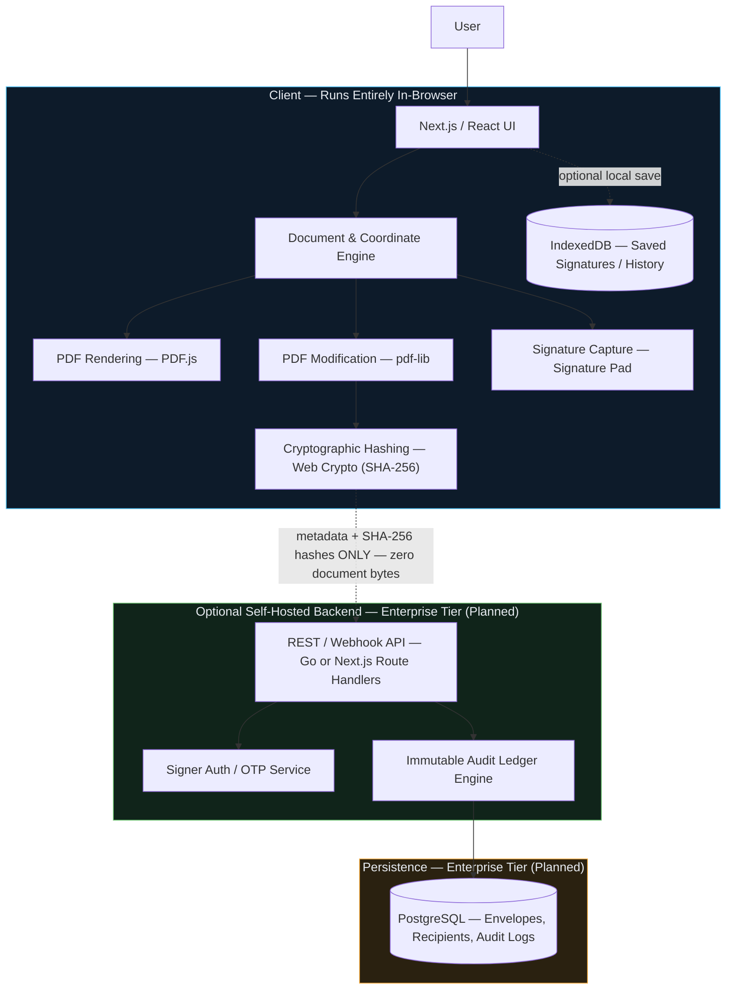
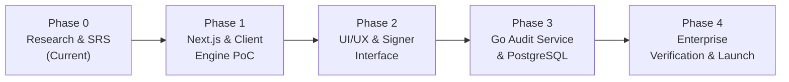

# InkSeal

**A privacy-first, browser-native PDF electronic signature platform — documents are signed entirely on the client, never uploaded to a server.**

[](./SRS.md)
[](./TECHNICAL_DECISIONS.md)
[](./SRS.md)
[](./TECHNICAL_DECISIONS.md)

---

## 2. Project Description

InkSeal is a browser-based tool for signing PDF documents — uploading, placing signature fields, capturing a signature, and embedding it directly into the PDF — with **all processing happening client-side**.

Mainstream e-signature platforms (DocuSign, Adobe Sign, and similar cloud tools) require uploading sensitive legal, financial, or healthcare documents to third-party servers. This creates privacy exposure, recurring SaaS cost, vendor lock-in, and compliance overhead (GDPR/HIPAA data-processing agreements).

InkSeal's core value proposition is a **zero-knowledge architecture**: PDF parsing, signature rendering, byte-level embedding, and cryptographic fingerprinting all run in the browser via WebAssembly and native Web APIs. In the default configuration, no document content, signature image, or audit data is ever transmitted over the network — the signed PDF is downloaded directly to the user's device.

An optional, self-hosted enterprise backend can be layered on top for multi-party signing coordination and audit logging — and even then, it only ever receives SHA-256 hashes and metadata, never document bytes.

---

## 3. Demo / Screenshots

> _Not yet available. The project is in the research/specification phase — screenshots and a live demo will be added once the client-side signing engine (Phase 1) is implemented._

---

## 4. Key Features

| Category | Capability |
|---|---|
| **PDF Handling** | Drag-and-drop or file-picker upload, structural validation, high-fidelity in-browser rendering with zoom/thumbnails |
| **Signature Placeholders** | Place, drag, resize, and delete signature/initials/date fields on any page |
| **Signature Capture** | Draw (canvas), type (cursive font), or upload an existing signature image |
| **In-Browser Signing** | Signature permanently embedded into PDF bytes client-side — no server round trip |
| **Verification / Integrity** | SHA-256 document fingerprinting computed before and after signing |
| **Audit Trail** | Structured JSON audit metadata embedded in the PDF and exportable as a standalone file |
| **Zero-Knowledge Privacy** | No document content leaves the browser by default; strict CSP with no outbound `connect-src` |
| **Offline Capability** | *(Planned)* Full offline operation via a PWA service worker once cached |
| **Enterprise Tier** | *(Planned)* Multi-party envelope routing, OTP/email signer authentication, immutable audit ledger — self-hosted, metadata-only backend |

---

## 5. Tech Stack

| Layer | Technology | Purpose |
|---|---|---|
| Frontend Framework | Next.js 14+ (App Router) | Unified full-stack React framework; supports SSR/SSG and code-split client bundles |
| Language | TypeScript 5.x | End-to-end type safety across coordinate math, byte buffers, and audit schemas |
| Styling | Tailwind CSS | Responsive design system with dark mode |
| PDF Rendering | PDF.js 4.x | In-browser PDF parsing and canvas rendering |
| PDF Manipulation | pdf-lib 1.17+ | Client-side, byte-level PDF signature embedding |
| Signature Capture | Signature Pad 4.x | Canvas-based signature drawing with pressure simulation |
| Cryptography | Web Crypto API (native) | Hardware-accelerated SHA-256 document fingerprinting |
| Local Storage | IndexedDB (via `idb`) | Local persistence of saved signatures and document history |
| Backend *(optional)* | Go (Golang) / Next.js Route Handlers | High-concurrency audit ingestion and envelope orchestration |
| Database *(optional)* | PostgreSQL 16+ | ACID-compliant relational storage with `JSONB` for field geometry; append-only audit tables |
| Data Layer *(optional)* | Prisma / Drizzle ORM | Type-safe migrations and generated TypeScript models |

---

## 6. Architecture Overview

InkSeal is a layered, client-first system. The default configuration never crosses the privacy boundary shown below; the optional backend only ever receives hashes and metadata.



**Privacy boundary:** In the default (v1.0) configuration, PDF bytes, signature images, and audit data never leave the browser. If the optional enterprise backend is enabled, only SHA-256 hashes and event metadata (timestamps, event types, optional signer email) are transmitted — document content is never sent.

---

## 7. Project Structure

Planned high-level structure for the Next.js + TypeScript implementation:

```
src/
├── app/          # Next.js App Router — pages, layouts, route handlers
├── components/   # Reusable UI components (viewer, overlays, modals)
├── features/     # Feature-scoped modules (upload, placeholders, signing, embedding)
├── lib/          # Cross-cutting utilities (coordinate transforms, i18n)
├── services/     # Business logic (document, embedding, audit trail, crypto)
├── hooks/        # Custom React hooks
└── types/        # Shared TypeScript types and schemas

backend/          # (Planned) Optional Go / Next.js audit & orchestration service
docs/             # SRS, ADR, and other architecture references
```

- **`services/`** contains the framework-agnostic business logic (document handling, signature embedding, audit trail generation, cryptographic hashing).
- **`features/`** groups UI + logic for a single user-facing capability.
- **`backend/`** is only relevant if the optional enterprise audit tier is deployed.

---

## 8. Getting Started

> ⚠️ **Status:** The project is currently in Phase 0 (Research & Specification) — no implementation code has been scaffolded yet. The steps below reflect the planned standard workflow for the selected stack and will be finalized once Phase 1 begins.

**Prerequisites**
- Node.js ≥ 20 LTS (frontend)
- Go ≥ 1.22 and PostgreSQL ≥ 16 — *only required for the optional self-hosted enterprise backend*

**Install dependencies** *(planned)*
```bash
npm install
```

**Environment setup**
```
TBD
```

**Run the development server** *(planned)*
```bash
npm run dev
```

---

## 9. Environment Variables

No environment variables have been finalized yet.

| Variable | Description | Status |
|---|---|---|
| — | Backend connection / auth configuration for the optional enterprise tier | `TBD` |

---

## 10. Team & Responsibilities

| Role | Owner |
|---|---|
| Project Lead / Architect | Ateeksh Soni |
| Frontend / Client Engine | `TBD` |
| Backend / Audit (Enterprise Tier) | `TBD` |
| UI/UX | `TBD` |
| Security / Verification | `TBD` |

---

## 11. Documentation

- [Software Requirements Specification](./SRS.md) — `INKSEAL-SRS-v1.0`
- [Technical Decisions & Architecture (ADR-001)](./TECHNICAL_DECISIONS.md) — `INKSEAL-ADR-001`

Additional architecture notes and research documents will be added to `docs/` as they are produced.

---

## 12. Project Status

**Current phase: Phase 0 — Research, Architecture & Specification (Active)**



Completed to date: the [Software Requirements Specification](./SRS.md) and [Technical Decisions ADR](./TECHNICAL_DECISIONS.md) are approved as the Phase 0 baseline. No application code has shipped yet.

---

## 13. License

License has not yet been finalized. `TBD`