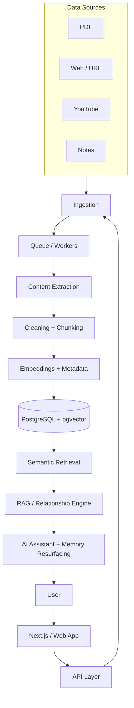

# Second Brain

An AI-powered personal knowledge system that turns fragmented information into connected, searchable, and continuously resurfacing knowledge.

---

## 2. Project Description

Second Brain is a developer-focused knowledge system built to solve two related problems: **knowledge fragmentation** and **knowledge decay**.

Most people already have places to store information — bookmarks, PDFs, notes apps, saved articles, saved videos. The real problem isn't storage; it's that saved knowledge stays disconnected and is eventually forgotten. Second Brain captures what a user learns, processes it into structured, embedded knowledge, connects it to what they already know, and resurfaces it when it becomes relevant again.

**Target users:** developers, students, and researchers who consume large amounts of technical information from multiple sources (articles, PDFs, videos, repositories, notes).

**Core value proposition:** instead of asking *"Where did I save that?"*, the user can ask *"What do I already know about this topic?"* — and the system also proactively reminds them of related knowledge they've previously saved and may have forgotten.

**Core product loop:**

```
Capture → Process → Understand → Store → Retrieve → Connect → Resurface
```

---

## 3. Demo / Screenshots

_Coming soon — this project is in the development stage._

---

## 4. Key Features

| Feature | Status |
|---|---|
| Knowledge capture (save articles, notes, links) | Planned |
| PDF ingestion | Planned |
| URL / web page ingestion | Planned |
| YouTube transcript ingestion | Planned |
| Asynchronous content processing (queue-based) | Planned |
| Cleaning + chunking of extracted content | Planned |
| Embedding generation | Planned |
| Semantic search over stored knowledge | Planned |
| RAG-based personal knowledge assistant | Planned |
| Knowledge relationships / knowledge graph | Planned |
| Agentic knowledge organization (topic detection, duplicate detection, relevance scoring) | Planned |
| Memory resurfacing ("you learned this before") | Planned |
| User knowledge management (view, edit, organize saved knowledge) | Planned |

---

## 5. Tech Stack

| Layer | Technology | Purpose |
|---|---|---|
| Frontend | Next.js + TypeScript | Application foundation and UI |
| Styling | Tailwind CSS | UI styling |
| Backend | Node.js + Express | API layer |
| Database | PostgreSQL | Primary data store (users, documents, chunks, tags, relationships, jobs) |
| Vector Search | pgvector | Semantic/vector search on embeddings |
| Queue | Redis + BullMQ | Asynchronous job processing for ingestion pipeline |
| AI / LLM | Ollama (local), with future support for OpenAI/Claude | Text generation, RAG responses |
| Embeddings | Ollama embedding model | Converting content chunks into vector embeddings |
| PDF Extraction | PDF parser | Extracting text from PDF documents |
| Web Extraction | Cheerio / Readability | Extracting clean content from web pages |
| YouTube | Transcript extraction | Extracting text from YouTube videos |
| Graph Visualization | D3.js | Visualizing knowledge relationships |
| Auth | JWT / OAuth | User authentication |
| Deployment | Docker + VPS / Render (TBD) | Hosting and deployment |
| Monitoring | OpenTelemetry | Planned for a later phase |

---

## 6. Architecture Overview

Second Brain follows a pipeline architecture: content enters through ingestion, is processed asynchronously, converted into embeddings, stored, and made retrievable through semantic search and a RAG-based assistant.



**Flow summary:**

1. A user saves content (PDF, web page, YouTube video, or note) through the web app.
2. The API validates the request and hands it off to a queue rather than processing it synchronously.
3. Background workers extract raw content, clean it, and split it into chunks.
4. Each chunk is embedded and stored alongside metadata in PostgreSQL with pgvector.
5. User queries go through semantic retrieval to find relevant chunks.
6. Retrieved chunks feed a RAG pipeline that grounds the AI assistant's answers in the user's own knowledge.
7. A relationship engine connects new knowledge to existing knowledge and resurfaces related items back to the user.

---

## 7. Project Structure

Planned high-level structure (Next.js + TypeScript):

```
app/          → Routes and pages (Next.js app router)
components/   → Shared, reusable UI components
features/     → Feature-oriented modules (capture, search, assistant, graph, etc.)
lib/          → Shared utilities, clients, and helpers
services/     → Business logic and integrations (extraction, embeddings, retrieval)
workers/      → Background job processors (queue consumers)
types/        → Shared TypeScript types and interfaces
config/       → Environment and application configuration
docs/         → Project and technical documentation
```

- **app/** — routes, pages, and layout for the Next.js application.
- **components/** — presentational, reusable UI building blocks.
- **features/** — self-contained functional areas of the product.
- **lib/** — shared low-level utilities and client setup.
- **services/** — core domain logic (ingestion, chunking, embeddings, retrieval).
- **workers/** — asynchronous job handlers backed by the queue.
- **types/** — shared type definitions across the app.
- **config/** — environment and runtime configuration.
- **docs/** — supporting engineering and design documentation.

---

## 8. Getting Started

### Prerequisites
- Node.js (version TBD)
- PostgreSQL with pgvector extension
- Redis
- Ollama (for local embeddings/LLM)

### Install
```bash
# TBD
```

### Environment
```bash
# TBD — see Environment Variables section
```

### Run
```bash
# TBD
```

---

## 9. Environment Variables

| Variable | Description | Status |
|---|---|---|
| DATABASE_URL | PostgreSQL connection string | TBD |
| REDIS_URL | Redis connection string | TBD |
| OLLAMA_HOST | Ollama service endpoint | TBD |
| JWT_SECRET | Auth token signing secret | TBD |

---

## 10. Team & Responsibilities

| Role | Owner | Notes |
|---|---|---|
| Product / Architecture | TBD | — |
| Backend / API | TBD | — |
| AI / RAG Pipeline | TBD | — |
| Frontend | TBD | — |

---

## 11. Documentation

Additional technical and architectural documentation (SRS, detailed design docs) will be linked here once available.

---

## 12. Project Status

**Current stage:** Planning / conceptual design. No components have been implemented yet.

**Roadmap:**

```
Foundation
   ↓
Knowledge Ingestion
   ↓
Processing Pipeline
   ↓
Semantic Search
   ↓
RAG
   ↓
Knowledge Relationships
   ↓
Memory Resurfacing
   ↓
Agentic Features
   ↓
Production
```

All phases above are currently **Planned**.

---

## 13. License

TBD